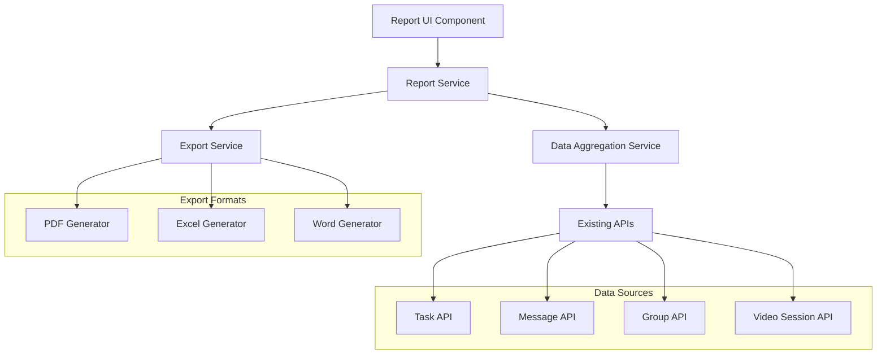

# Design Document

## Overview

The Project Report Generator feature will provide comprehensive reporting capabilities for the StudyHub application, allowing users to export detailed information from various dashboard components in multiple formats (Word, PDF, Excel). The system will leverage existing data models and API endpoints while introducing new report generation services and UI components.

## Architecture

### High-Level Architecture



### Component Architecture

The system will be built using the existing React/Node.js architecture with the following new components:

- **Frontend**: React components for report configuration and generation
- **Backend**: Express.js services for data aggregation and report generation
- **Export Libraries**: Integration with document generation libraries

## Components and Interfaces

### Frontend Components

#### 1. ReportGenerator Component
```javascript
interface ReportGeneratorProps {
  groupId?: string;
  onReportGenerated?: (reportUrl: string) => void;
}

interface ReportConfig {
  dataSources: DataSource[];
  format: 'pdf' | 'excel' | 'word';
  dateRange: {
    startDate: Date;
    endDate: Date;
  };
  customization: {
    includeHeaders: boolean;
    includeBranding: boolean;
    title?: string;
  };
}
```

#### 2. DataSourceSelector Component
```javascript
interface DataSource {
  type: 'group-management' | 'task-manager' | 'chat' | 'video-chat' | 'members';
  enabled: boolean;
  fields: string[];
}
```

#### 3. ReportPreview Component
```javascript
interface ReportPreviewProps {
  config: ReportConfig;
  sampleData: any;
}
```

### Backend Services

#### 1. Report Service (`/backend/services/reportService.js`)
```javascript
class ReportService {
  async generateReport(config: ReportConfig, userId: string): Promise<string>
  async getReportStatus(reportId: string): Promise<ReportStatus>
  async scheduleReport(config: ReportConfig, schedule: Schedule): Promise<string>
}
```

#### 2. Data Aggregation Service (`/backend/services/dataAggregationService.js`)
```javascript
class DataAggregationService {
  async aggregateGroupData(groupId: string, dateRange: DateRange): Promise<GroupData>
  async aggregateTaskData(groupId: string, dateRange: DateRange): Promise<TaskData>
  async aggregateChatData(groupId: string, dateRange: DateRange): Promise<ChatData>
  async aggregateVideoData(groupId: string, dateRange: DateRange): Promise<VideoData>
  async aggregateMemberData(groupId: string): Promise<MemberData>
}
```

#### 3. Export Service (`/backend/services/exportService.js`)
```javascript
class ExportService {
  async generatePDF(data: ReportData, config: ReportConfig): Promise<Buffer>
  async generateExcel(data: ReportData, config: ReportConfig): Promise<Buffer>
  async generateWord(data: ReportData, config: ReportConfig): Promise<Buffer>
}
```

### API Endpoints

#### Report Generation Endpoints
```
POST /api/report/generate
GET /api/report/status/:reportId
GET /api/report/download/:reportId
POST /api/report/schedule
GET /api/report/scheduled
DELETE /api/report/scheduled/:scheduleId
```

#### Data Aggregation Endpoints
```
GET /api/report/data/group/:groupId
GET /api/report/data/tasks/:groupId
GET /api/report/data/chat/:groupId
GET /api/report/data/video/:groupId
GET /api/report/data/members/:groupId
```

## Data Models

### Report Configuration Model
```javascript
const ReportConfigSchema = new mongoose.Schema({
  Report_userId: { type: ObjectId, ref: 'User', required: true },
  Report_groupId: { type: ObjectId, ref: 'Group', required: true },
  Report_name: { type: String, required: true },
  Report_dataSources: [{
    type: { type: String, enum: ['group-management', 'task-manager', 'chat', 'video-chat', 'members'] },
    enabled: { type: Boolean, default: true },
    fields: [String]
  }],
  Report_format: { type: String, enum: ['pdf', 'excel', 'word'], required: true },
  Report_dateRange: {
    startDate: Date,
    endDate: Date
  },
  Report_customization: {
    includeHeaders: { type: Boolean, default: true },
    includeBranding: { type: Boolean, default: true },
    title: String
  },
  Report_createdAt: { type: Date, default: Date.now },
  Report_updatedAt: { type: Date, default: Date.now }
});
```

### Report Generation Job Model
```javascript
const ReportJobSchema = new mongoose.Schema({
  ReportJob_userId: { type: ObjectId, ref: 'User', required: true },
  ReportJob_configId: { type: ObjectId, ref: 'ReportConfig', required: true },
  ReportJob_status: { 
    type: String, 
    enum: ['pending', 'processing', 'completed', 'failed'], 
    default: 'pending' 
  },
  ReportJob_filePath: String,
  ReportJob_fileSize: Number,
  ReportJob_error: String,
  ReportJob_createdAt: { type: Date, default: Date.now },
  ReportJob_completedAt: Date
});
```

### Scheduled Report Model
```javascript
const ScheduledReportSchema = new mongoose.Schema({
  ScheduledReport_userId: { type: ObjectId, ref: 'User', required: true },
  ScheduledReport_configId: { type: ObjectId, ref: 'ReportConfig', required: true },
  ScheduledReport_frequency: { 
    type: String, 
    enum: ['daily', 'weekly', 'monthly'], 
    required: true 
  },
  ScheduledReport_nextRun: { type: Date, required: true },
  ScheduledReport_lastRun: Date,
  ScheduledReport_isActive: { type: Boolean, default: true },
  ScheduledReport_emailDelivery: {
    enabled: { type: Boolean, default: false },
    recipients: [String]
  }
});
```

## Error Handling

### Error Types
```javascript
class ReportError extends Error {
  constructor(message, code, details = {}) {
    super(message);
    this.code = code;
    this.details = details;
  }
}

// Error codes
const ERROR_CODES = {
  INSUFFICIENT_PERMISSIONS: 'INSUFFICIENT_PERMISSIONS',
  DATA_NOT_FOUND: 'DATA_NOT_FOUND',
  EXPORT_FAILED: 'EXPORT_FAILED',
  INVALID_CONFIG: 'INVALID_CONFIG',
  RATE_LIMIT_EXCEEDED: 'RATE_LIMIT_EXCEEDED'
};
```

### Error Handling Strategy
- **Client-side**: Display user-friendly error messages with recovery suggestions
- **Server-side**: Log detailed errors for debugging while returning sanitized messages to clients
- **Validation**: Validate report configurations before processing
- **Fallback**: Provide partial reports when some data sources fail

## Testing Strategy

### Unit Tests
- **Data Aggregation**: Test data collection from various sources
- **Export Services**: Test document generation for each format
- **Permission Validation**: Test access control for different user roles
- **Configuration Validation**: Test report configuration validation

### Integration Tests
- **End-to-End Report Generation**: Test complete report generation workflow
- **API Endpoints**: Test all report-related API endpoints
- **File Download**: Test report download functionality
- **Scheduled Reports**: Test automated report generation

### Performance Tests
- **Large Dataset Handling**: Test with groups containing large amounts of data
- **Concurrent Report Generation**: Test multiple users generating reports simultaneously
- **Memory Usage**: Monitor memory consumption during report generation
- **Response Times**: Ensure reports generate within acceptable time limits

### Test Data Requirements
- Groups with varying sizes (small, medium, large)
- Different data types (tasks, messages, video sessions)
- Various date ranges and filtering scenarios
- Different user permission levels

## Security Considerations

### Access Control
- Verify user permissions for requested data sources
- Implement group-level access controls
- Validate user membership in groups before generating reports

### Data Privacy
- Filter sensitive information based on user roles
- Exclude private messages or confidential task details
- Implement data anonymization options

### Rate Limiting
- Limit number of reports per user per time period
- Implement queue system for report generation
- Monitor system resources during report generation

## Performance Optimization

### Caching Strategy
- Cache frequently requested data aggregations
- Implement Redis caching for report metadata
- Cache generated reports for repeated downloads

### Database Optimization
- Add indexes for report-related queries
- Optimize data aggregation queries
- Implement pagination for large datasets

### File Management
- Implement automatic cleanup of old report files
- Use cloud storage for report file storage
- Compress generated reports to reduce file size

## Scalability Considerations

### Horizontal Scaling
- Design stateless report generation services
- Implement job queue system for background processing
- Use microservices architecture for different export formats

### Resource Management
- Monitor CPU and memory usage during report generation
- Implement circuit breakers for external dependencies
- Use streaming for large data processing

### Future Enhancements
- Support for custom report templates
- Integration with external BI tools
- Real-time report updates
- Advanced analytics and insights